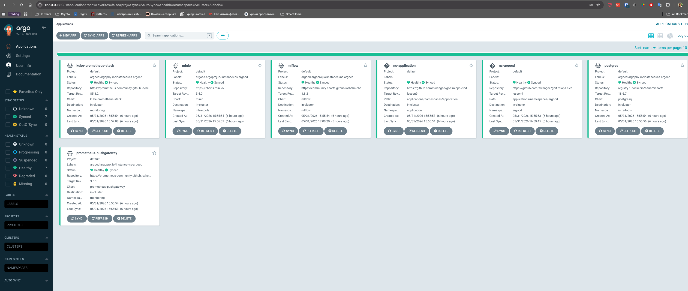

## Архітектура

Один root-стек, **локальний стейт** (`terraform.tfstate` у корені), розгортання в
**локальний Kubernetes** (`docker-desktop`):

- `argocd/` — встановлення Argo CD у кластер через Helm (провайдери `kubernetes`, `helm`).
- `argocd-apps/` — Argo CD-ресурси поверх установленого Argo CD: `argocd_application_set`
  з git-генератором каталогів (провайдер `argocd`).

Провайдери `kubernetes`/`helm` беруть конфіг із `~/.kube/config` (контекст
`docker-desktop`). Провайдер `argocd` підключається до `argocd-server` через
**port-forward** (автентифікація admin-паролем із secret'а
`argocd-initial-admin-secret`; `plain_text`, бо сервер запущено з `--insecure`).

Провайдери сконфігуровані в root, модулі їх успадковують.
Порядок розгортання: `argocd → argocd-apps` (через `depends_on`).

> Раніше стек піднімав власний кластер на AWS (VPC + EKS, стейт у S3). Зараз він
> мігрований на локальний `docker-desktop` — кластер уже існує, тож Terraform лише
> ставить у нього Argo CD та застосунки.

## Передумови

- Запущений локальний Kubernetes (Docker Desktop з увімкненим Kubernetes),
  контекст `docker-desktop` у `~/.kube/config`.
- `terraform >= 1.5`, `kubectl`, `helm`.
- `uv` — для ML-пайплайна `model-runner/`.

Контекст і namespace за потреби перевизначаються через змінні
(`kubeconfig_context`, `argocd_namespace` тощо у `variables.tf`).

## Запуск (з нуля)

> Провайдер `argocd` бере пароль із secret'а, що зʼявляється лише після встановлення
> Argo CD. Тому перший прогін **двофазний**: спершу встановити Argo CD, потім —
> Argo CD-ресурси.

```bash
make init            # 1. ініціалізація
make apply-argocd    # 2. фаза 1 — встановлення Argo CD (створює admin-secret)
make apply           # 3. фаза 2 — argocd_application_set
```

Коли Argo CD уже встановлений, подальші зміни застосовуються в один прохід:

```bash
make plan    # переглянути зміни
make apply   # застосувати
```

## Маніфести застосунків (Де зберігаються applications)

Застосунки для розкатки через ArgoCD зберігаються в директорії:
`applications/namespaces/`

Модуль `argocd-apps` створює `ApplicationSet` із git-генератором каталогів, що читає
шлях `applications/namespaces/*` з репозиторію `app_repo_url`
(`https://github.com/swangee/goit-mlops-cicd.git`, гілка `lesson9`). Argo CD створює
по одному `Application` (`ns-<папка>`) на кожен підкаталог і деплоїть його вміст у
namespace з тією ж назвою (`CreateNamespace=true`, `recurse`).

Розкладка по namespace (модель «централізований hub»):

| namespace | Що там | Як зʼявляється |
|-----------|--------|----------------|
| `argocd` | ArgoCD + усі `Application`-обʼєкти (App-of-Apps) | Terraform (ns + Helm) |
| `infra-tools` | MinIO, PostgreSQL (спільне сховище/БД) | `CreateNamespace=true` |
| `monitoring` | kube-prometheus-stack, Pushgateway | `CreateNamespace=true` |
| `mlflow` | MLflow Tracking Server | `CreateNamespace=true` |
| `application` | demo-nginx | `ns.yaml` у папці |

Важливо: ArgoCD стежить за `Application`-обʼєктами **лише у власному ns (`argocd`)**
(apps-in-any-namespace вимкнено). Тому `Application`-CRD інфри лежать у папці
`applications/namespaces/argocd/` (щоб потрапити в ns `argocd`), а самі сервіси
розводяться по цільових namespace через `destination.namespace`. Сирі маніфести
(як `application/`) деплояться у власний namespace напряму.

Щоб додати новий застосунок: для Helm-сервісу — додати `Application`-CRD у папку
`argocd/` з потрібним `destination.namespace`; для звичайних маніфестів — створити
нову папку-namespace з YAML-ресурсами.

## ML-пайплайн (`model-runner/`)

Тюнінг `SGDClassifier` на Iris через Optuna: кожен trial логується в **MLflow**,
метрики (`model_accuracy`, `model_loss`) пушаться в **Prometheus PushGateway**,
найкраща модель копіюється в `model-runner/best_model/`.

Запуск і доступ до MLflow / PushGateway / Grafana описані в
[`model-runner/README.md`](model-runner/README.md). Стисло:

```bash
cd model-runner
uv sync
uv run train_and_push.py
```

## Підключення до Nginx Service

Щоб підключитися до розгорнутого сервісу Nginx локально, використайте `kubectl port-forward`:

```bash
kubectl port-forward svc/nginx-service -n application 8081:80
```

Після цього Nginx буде доступний за адресою [http://localhost:8081](http://localhost:8081).

## Підключення до ArgoCD

Щоб отримати початковий пароль адміністратора (користувач `admin`), виконайте команду:

```bash
kubectl -n argocd get secret argocd-initial-admin-secret -o jsonpath="{.data.password}" | base64 -d
```

Щоб підключитися до веб-інтерфейсу ArgoCD локально, використайте `kubectl port-forward`:

```bash
kubectl port-forward svc/argocd-server -n argocd 8080:80
```

Після цього ArgoCD буде доступний за адресою [http://localhost:8080](http://localhost:8080).

## Скриншоти

**ArgoCD**



**MLflow UI**


**Grafana Explore**


## Видалення

```bash
# контекст kubeconfig має вказувати на кластер (k8s/helm/argocd-ресурси видаляються першими)
make destroy
```
