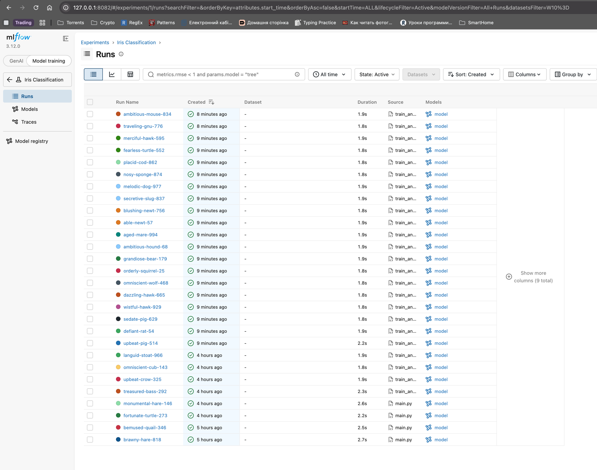
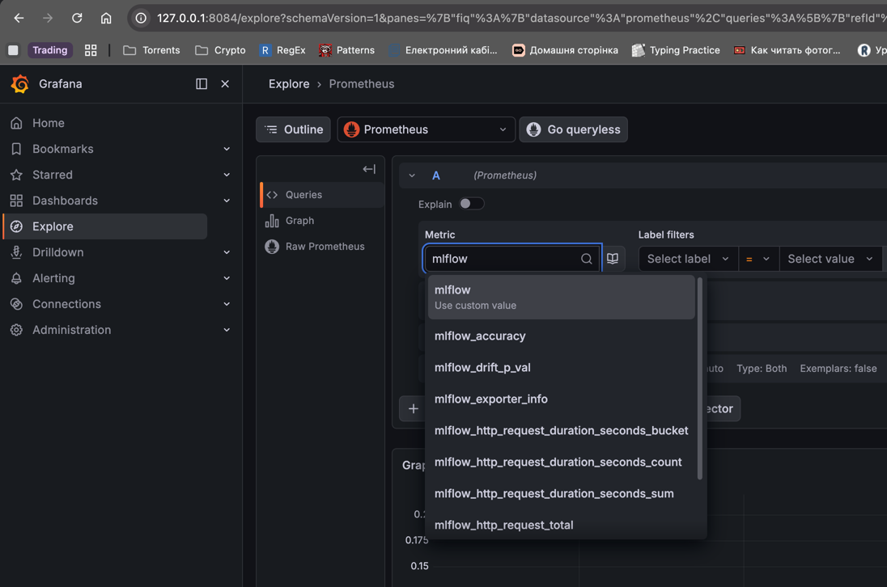

# model-runner

Тюнінг `SGDClassifier` на Iris через Optuna. Кожен trial логується в **MLflow**,
метрики (`model_accuracy`, `model_loss`) пушаться в **Prometheus PushGateway**,
найкраща модель копіюється в `best_model/`.

> Кластер, Argo CD, namespaces (`mlflow`, `monitoring`, `infra-tools`) і спільні
> MinIO/Postgres описані в [`../README.md`](../README.md). Тут — лише запуск пайплайна
> та доступ до MLflow/PushGateway/Grafana.

## Запуск

```bash
uv sync                  # встановити залежності
uv run train_and_push.py
```

Адреси беруться з `.env` (`MLFLOW_TRACKING_URI`, `PUSHGATEWAY_URL`, MinIO-креди).
Перед запуском підніми port-forward (нижче).

## Перевірка сервісів у кластері

```bash
kubectl get pods -n mlflow      # MLflow Tracking Server
kubectl get pods -n monitoring  # PushGateway + Grafana (kube-prometheus-stack)
```

## Port-forward

```bash
kubectl port-forward -n mlflow     svc/mlflow                        8082:5000  # MLflow UI
kubectl port-forward -n monitoring svc/prometheus-pushgateway        8085:9091  # PushGateway
kubectl port-forward -n monitoring svc/kube-prometheus-stack-grafana 8084:80    # Grafana
```

- MLflow UI — http://localhost:8082
- PushGateway — http://localhost:8085
- Grafana — http://localhost:8084 (admin / `goit-grafana-password`)

## Метрики в Grafana

Prometheus скрейпить PushGateway автоматично (ServiceMonitor). У Grafana:
**Explore → Prometheus**, запити:

```promql
model_accuracy
model_loss
```

Розріз по запусках — лейбл `run_id` (наприклад `model_accuracy{job="train_and_push"}`).

## Скриншоти

**MLflow UI**



**Grafana Explore**


